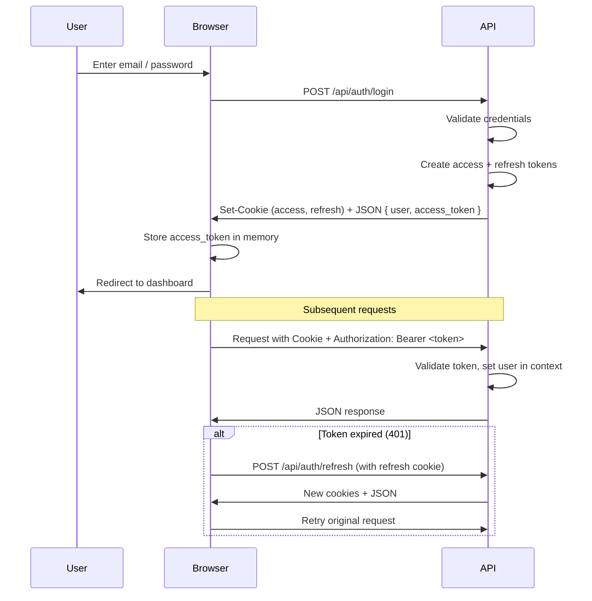
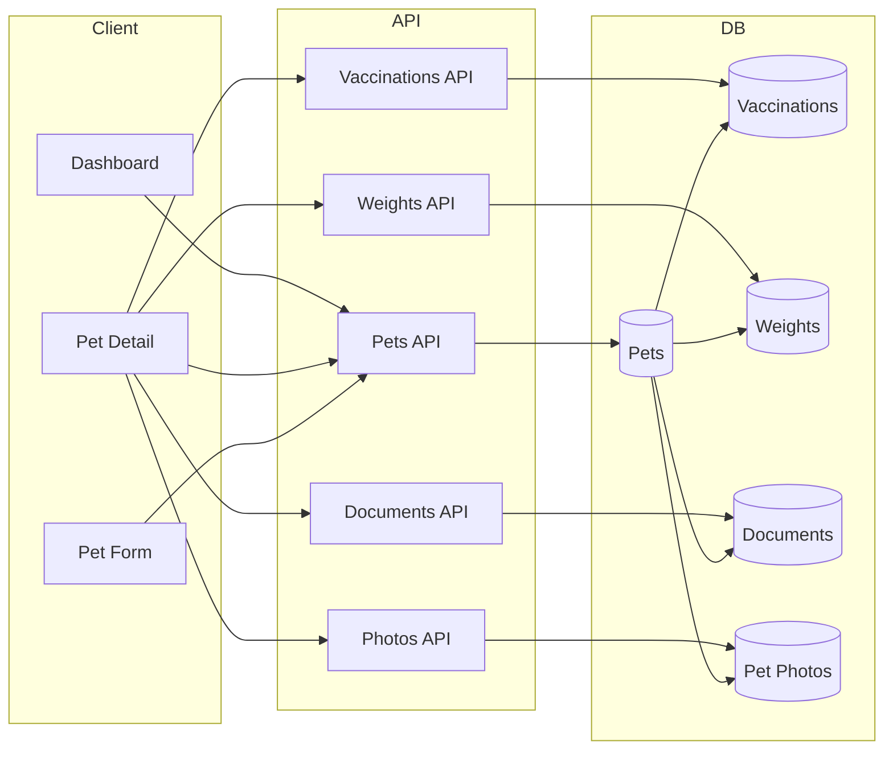
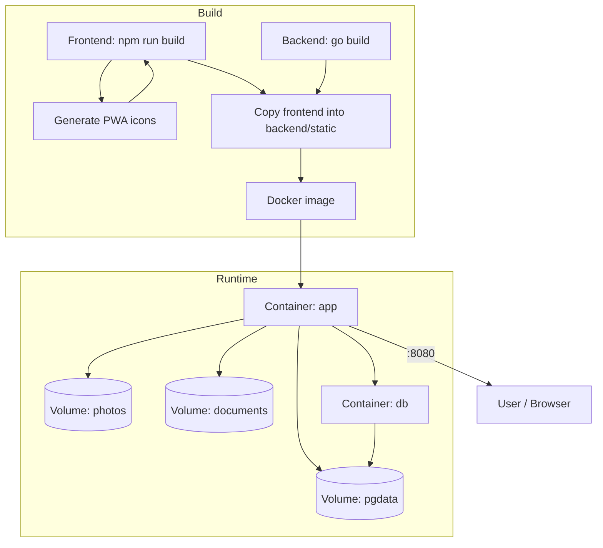
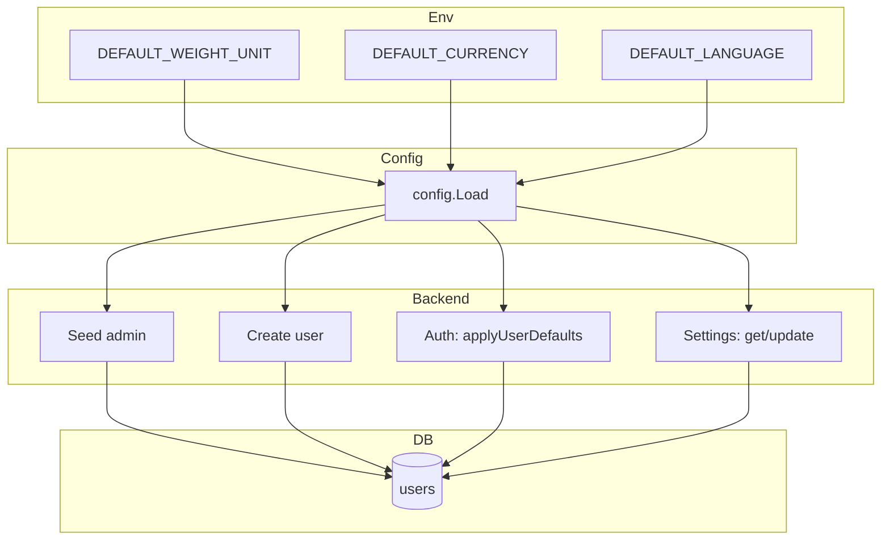
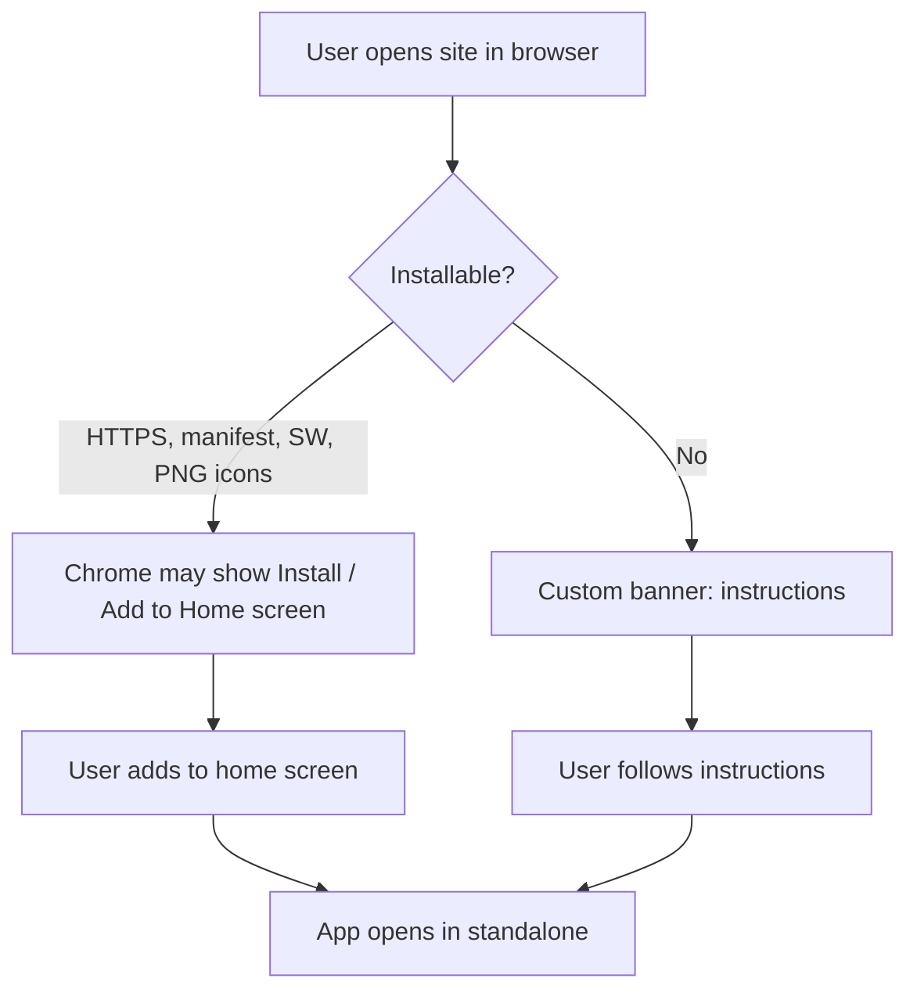

# Flowcharts

Diagrams are in [Mermaid](https://mermaid.js.org/) format. You can view them in any Markdown viewer that supports Mermaid (e.g. GitHub, GitLab, or VS Code with a Mermaid extension).

---

## Authentication flow

---

## Pet and related data flow

---

## Deployment (Docker)

---

## Defaults and settings flow

---

## PWA install flow (simplified)

